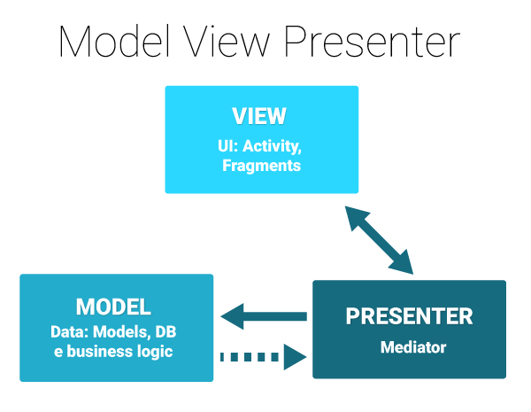

# LastFmValidTest
 Valid Android Test Level II & III

# Last FM application:
 - Koin
 - Kotlin Coroutines
 - Navigation
 - Retrofit2
 - Koin ViewModel
 - MVP
 - Unit Testing (coroutines-test, io.mockk, junit)
 
 # Arquitectura
   * La capa de datos donde se establece la persistencia ya sea a una base de datos local tipo SQLite, Realm o uso de SharedPreferences, así como tambien 
   uso de servicios Web del tipo REST u otros usando Retrofit, Volley u otros para la persistencia en la nube. Ademas se puede aplicar el Repository Pattern
   el cual permite persistir localmente cuando se cuenta con una pobre o inexistente conexion a Internet o se usa una CACHE para eliminar la latencia tanto en 
   el consumo de informacion como en la persistencia de datos. Si se usa el Repository Pattern la persistencia local es mas sencilla usando Room Library.
   
 * La capa de dominio donde se hace uso de Interactors o Use Cases, en la cual se ejecuta la logica de negocio y se controla la persistencia u obtencion de datos, 
   asi como tambien se pueden disparar estas operaciones en segundo plano. Gracias a esta capa se hace una diferenciacion y se añade una capa mas de abstraccion 
   que permite desligar el modelo de datos de las operaciones. Esto permitira al Interactor realizar sus tareas sin responsabilizarse de la capa de datos.
   
  ## MVP
   
   1. Primero para comenzar el proyecto con el modelo MVP fue necesario agrupar por paquetes, los cuales fueron nombrados tomando 
como referencia el nombre de los casos de uso.

   2. Vamos a trabajar con "Fragments" estos pertenecen a la capa vista y no manejan logica de negocio, ni llamadas
a servicios, se mantienen lo mas limpios posible. Es decir tiene que ser dependiente de la informacion y operaciones que realize 
la capa Presenter. 

  3. Se establecio la capa Presenter en base a contratos o especificaciones (interfaces) que describen las validaciones y operaciones 
que seran controladas a traves de esta capa, en esta misma se hace una especie de orquestacion de las funcionalidades donde se controla 
el inicio y fin, pero no debe realizarse logica de negocio, ni llamadas a ejecuciones en segundo plano y mucho menos operaciones de networking.



### Bocetos

### Paleta de Colores

### Screenshots

### License
```
   Copyright (C) 2020 Juan Camilo Sandoval Devia

   Licensed under the Apache License, Version 2.0 (the "License");
   you may not use this file except in compliance with the License.
   You may obtain a copy of the License at

       http://www.apache.org/licenses/LICENSE-2.0

   Unless required by applicable law or agreed to in writing, software
   distributed under the License is distributed on an "AS IS" BASIS,
   WITHOUT WARRANTIES OR CONDITIONS OF ANY KIND, either express or implied.
   See the License for the specific language governing permissions and
   limitations under the License.
```

   
